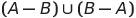

# Zadania laboratoryjne: Kolekcje i wyjątki

| Termin oddania | Punkty     |
|----------------|:-----------|
| 29.05.2021 23:00    |    15      |

## Zadanie 1 (1 pkt)

Napisz program, który pobierze od użytkownika liczby (może być ich dowolna ilość) 
i umieści je w posortowanym zbiorze (eliminując duplikaty). 
Następnie program ma wypisać ten zbiór na ekranie. Skorzystaj z kolekcji `Set`.

> Dane wejściowe: 1 1 2 2 3 3

> Dane wyjściowe: [1, 2 ,3]


## Zadanie 2 (2 pkt)

Napisz program, który utworzy dwa zbiory, wczyta je od użytkownika 
(liczby dla pierwszego zbioru będą podane w pierwszej linii, dla drugiego w drugiej linii). 
Wynikiem programu ma być wypisanie zbioru, który jest wynikiem operacji:



>Dane wejściowe: 
> 
> 1 3 4 6 7 9
> 
> 3 5 6 7 8 9
> 
> Dane wyjściowe: [1, 4 ,5 ,8]

## Zadanie 3 (2 pkt)
Napisz program, który będzie wczytywał ciąg znaków w jednej linii od użytkownika 
i wyświetli liczbę wystąpień każdego ze słów. 
Skorzystaj ze struktury słownikowej. 
Kolekcja powinna być posortowana po kluczach.

>Dane wejściowe: ala ma kota i ala ma psa i fajnie że wszystko ma
>
> Dane wyjściowe: {ala=2, fajnie=1, i=2, kota=1, ma=3, psa=1, wszystko=1, że=1}


## Zadanie 4 (1 pkt)

Napisz klasę `TestScores` (wyniki testów). 
Konstruktor w tej klasie powinien przyjmować jako argument tablicę wyników testów. 
W klasie powinna znajdować się metoda zwracająca średnią wyników testów. 
Jeśli któryś z wyników w tablicy jest ujemny lub wyższy od 100, 
to klasa powinna zgłaszać wyjątek typu `IllegalArgumentException`.


## Zadanie 5 (5 pkt)

Rozważmy następujący kod programu:
```
import java.util.*;

class Hamster {
  private int hamsterNumber;
  Hamster(int i) { hamsterNumber = i; }
  public String hamsterNumber() {
    return "This is Hamster #" + hamsterNumber;
  }
}

class Printer {
    static void printAll(List<Hamster> hl) {

    }
}

public class HamsterMaze {
  public static void main(String[] args) {
      List<Hamster> v = new ArrayList<Hamster>();

      for(int i = 0; i < 3; i++)
	    v.add(new Hamster(i));
      
      Printer.printAll(v);
  }
}
```
Dla powyższego kodu wykonaj następujące zadania:
- **[0.5 pkt]** Uzupełnij metodę `printAll` wyświetlającą dane o przechowywanych obiektach.
- **[0.5 pkt]** Dodaj pole typu `String` do klasy `Hamster`, zawierające imię gryzonia.
- **[1 pkt]** W klasie `HamsterMaze` stwórz odwzorowanie typu `Map`, 
  kojarzące imię gryzonia (jako klucz) z samym obiektem jako wartością.
- **[2 pkt]** W metodzie `main` klasy `HamsterMaze` powinno dokonywać się pobieranie danych 
  (identyfikator oraz imię), które będzie zapisywane w odwzorowaniu `Map`. 
  W przypadku nieprawidłowych danych (identyfikator ujemny lub jako ciąg tekstowy) 
  program powinien przechwycić wyjątek i ponownie wczytać dane.
- **[2 pkt]** Program w metodzie `main` po wywołaniu `printAll` 
  ma przeglądać odwzorowanie dla każdego klucza (korzystając z metody `keySet()`).


## Zadanie 6 (4 pkt) 
Zmodyfikuj poprzednie zadanie (zapisując je w osobnym pliku tak), 
aby spełniał następujące warunki:
- **[1 pkt]** Przeglądał zawartość listy w metodzie `printAll` 
        za pomocą użycia iteratora
- **[1 pkt]** W klasie `HamsterMaze` powinna znajdować się metoda usuwającą 
  element z listy za pomocą użycia iteratora
- **[2 pkt]** Zaimplementuj w klasie `Hamster` interfejs `Comparable<Hamster>`, 
  następnie korzystając z tego interfejsu posortuj listę za pomocą 
  metody sort z klasy `Collections`.

